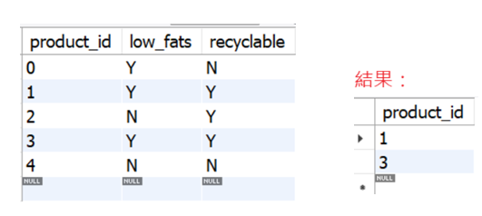
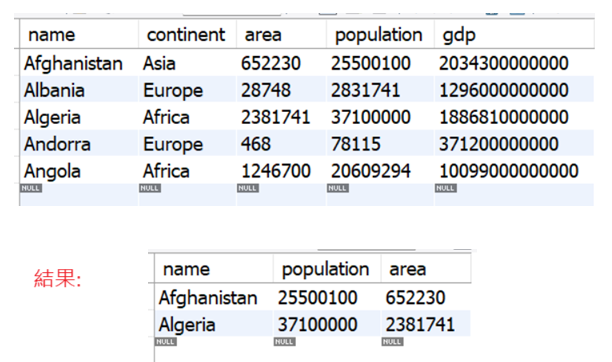

# MySql-Pandas
#新建資料夾的方式：GitHub 不允許建立「空資料夾」，所以你需要放一個暫時的檔案   
#在名稱地方輸入：images/placeholder.txt，暫時建立placeholder.txt檔，並建立"images"的資料夾   

#建議順序：mysql→python，其中mysql3 → python3 → python3-usemysql (使用mysql的資料表需在mysql中先建立) → python4是要在python中直接建立mysql的資料表 → mysql4

#由於.sql的檔案是純文字檔，所以無法渲染出圖片，因此額外開images的資料夾存放mysql執行結束前後的樣貌  
Mysql圖片：   
  
  

